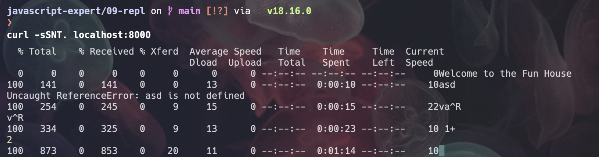

# README

## REPL

> The node:repl module provides a Read-Eval-Print-Loop (REPL) implementation that is available both as a standalone program or includible in other applications. It can be accessed using:

```
const repl = require('node:repl'); 
```

Commands and special keys#
The following special commands are supported by all REPL instances:

```
.break: When in the process of inputting a multi-line expression, enter the .break command (or press Ctrl+C) to abort further input or processing of that expression.

.clear: Resets the REPL context to an empty object and clears any multi-line expression being input.

.exit: Close the I/O stream, causing the REPL to exit.

.help: Show this list of special commands.

.save: Save the current REPL session to a file: > .save ./file/to/save.js

.load: Load a file into the current REPL session. > .load ./file/to/load.js

.editor: Enter editor mode (Ctrl+D to finish, Ctrl+C to cancel).
```

Refs:

- https://javascriptexpert.club.hotmart.com/lesson/a4RLAp5L7n/depurando-aplicacoes-via-terminal-com-node.js-read-eval-print-loop-(repl)
- https://nodejs.org/api/repl.html#repl_repl
- https://blog.cleancoder.com/uncle-bob/2020/05/27/ReplDrivenDesign.html
- [Running a "full-featured" REPL using a net.Server and net.Socket](https://gist.github.com/TooTallNate/2209310)
- [Running a node.js REPL over `curl` (GIST)
](https://gist.github.com/TooTallNate/2053342)




## DEBUGGING

```
node inspect index.mjs 
```